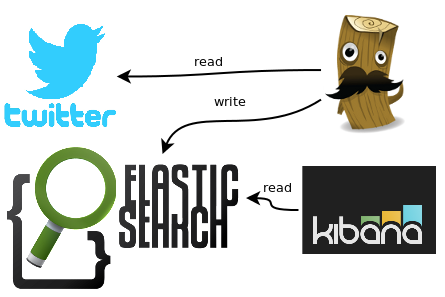

# elasticsearch-ELK stack

**elasticsearch** is an open source distributed document store and search engine that stores and retrieves data structures in near real-time.

Elasticsearch represents data in the form of structured JSON documents, and makes full-text search accessible via RESTful API and web clients for languages like PHP, Python, and Ruby. It’s also elastic in the sense that it’s easy to scale horizontally—simply add more nodes to distribute the load. Today, many companies, including Wikipedia, eBay, GitHub, and Datadog, use it to store, search, and analyze large amounts of data on the fly.

This application will manage the following:

* 3 x Elasticsearch Master node - intended for clustering management only, no data, no HTTP API

* 3 x Elasticsearch Client node - intended for client usage, no data, with HTTP API

* 3 x Elasticsearch Data node - intended for storing and indexing data, no HTTP API

* 1 x Kibana - is an open source analytics and visualization platform designed to work with Elasticsearch. Kibana lets you visualize your Elasticsearch data and navigate the Elastic Stack.Its simple, browser-based interface enables you to quickly create and share dynamic dashboards that display changes to Elasticsearch queries in real time.

* 1 x Logstash - is an open source tool for collecting, parsing, and storing logs for future use. Kibana 3 is a web interface that can be used to search and view the logs that Logstash has indexed. Both of these tools are based on Elasticsearch. Elasticsearch, Logstash, and Kibana, when used together is known as an ELK stack.


## Installation

You can install ELK stack on Magalix through few simple steps:

1- Create new app

2- Select elasticsearch template from the Demo Apps templates

3- You can now get the running application URL from the console, by clicking Endpoints 


## Configuration

Elasticsearch has the ability to store large quantities of semi-structured (JSON) data and provides the ability to quickly and easily query this data. This makes it a good option for storing Twitter data which is delivered as JSON and a perfect candidate for the project I'm working on.




### Connecting to Twitter

1- Register an application at http://apps.twitter.com

2- After creating you application you will be redirected to your application-page

3- You will be able to collect the required keys : 

- consumer key 

- consumer secret 

4- Click "Keys and Access Tokens" tab, and then create an access token.

5- These values are required to be filled in the Magalix app configuration section for logstash

### logstash

We will configure logstash to connect to Twitter as logstash-input, and Elasticsearch as logstash-output, based on the configured keywords, in Magalix configuration.

This configuration is being saved during the app creation in the Magalix commands using echo command. 

```
input {
 	twitter {
 		consumer_key => "${TWITTER_CONSUMER_KEY}"
 		consumer_secret => "${TWITTER_CONSUMER_SECRET}"
 		oauth_token => "${TWITTER_OAUTH_TOKEN}"
 		oauth_token_secret => "${TWITTER_OAUTH_TOKEN_SECRET}"
 		keywords => ["${TWITTER_KEYWORDS}"] 
	    full_tweet => true
 	}
 }
 output {
 	elasticsearch {
 		hosts => "elasticsearch:9200"
 	}
 }
```

The parameters above are being passed using the env-vars in Magalix console

### Configuration

| Parameter                          | Description                        |
| ---------------------------------- | ---------------------------------- |
| `TWITTER_CONSUMER_KEY`             | CONSUMER_KEY_GOES_HERE             |
| `TWITTER_CONSUMER_SECRET`          | CONSUMER_SECRET_GOES_HERE          |
| `TWITTER_OAUTH_TOKEN`              | ACCESS_TOKEN_GOES_HERE             |
| `TWITTER_OAUTH_TOKEN_SECRET`       | ACCESS_TOKEN_SECRET_GOES_HERE      |
| `TWITTER_KEYWORDS`                 | Seach keywords separated by commas |

### Testing the configuration

Make sure that the logstash is up and running by examing the url:

```
http://<LOGSTASH_END_POINT>:9200
```

You should see something similar to the following

```
{
  "name" : "es-client-864b45c866-68f45",
  "cluster_name" : "myesdb",
  "cluster_uuid" : "hMCMXG7hQSOpZ6BNu-sO_Q",
  "version" : {
    "number" : "6.1.0",
    "build_hash" : "c0c1ba0",
    "build_date" : "2017-12-12T12:32:54.550Z",
    "build_snapshot" : false,
    "lucene_version" : "7.1.0",
    "minimum_wire_compatibility_version" : "5.6.0",
    "minimum_index_compatibility_version" : "5.0.0"
  },
  "tagline" : "You Know, for Search"
}
```

To see cluster information:

```
http://<LOGSTASH_END_POINT>:9200/_cluster/health?pretty
```
You should see something similar to the following

```
{
  "cluster_name" : "myesdb",
  "status" : "green",
  "timed_out" : false,
  "number_of_nodes" : 7,
  "number_of_data_nodes" : 2,
  "active_primary_shards" : 0,
  "active_shards" : 0,
  "relocating_shards" : 0,
  "initializing_shards" : 0,
  "unassigned_shards" : 0,
  "delayed_unassigned_shards" : 0,
  "number_of_pending_tasks" : 0,
  "number_of_in_flight_fetch" : 0,
  "task_max_waiting_in_queue_millis" : 0,
  "active_shards_percent_as_number" : 100.0
}
```


## Visualizing

After configuring the desired twitter-keywords, and configure logstash to connect to both Twitter and Elasticsearch, you may need to create a graphical depiction of the data so that you can identify trends over time.

You will be able to do this using Kibana, but accessing the following link:

```
http://<KIBANA_END_POINT>/api/v1/proxy/namespaces/default/services/kibana/proxy
```

The first time you visit the Kibana URL you will be asked to configure your index. Select the rquired index and select the option for time series values and select @timestamp.

On the following page, select the Discover tab and you should see the ingested logs. You can set the refresh interval to 5 seconds to have the logs regularly refreshed.