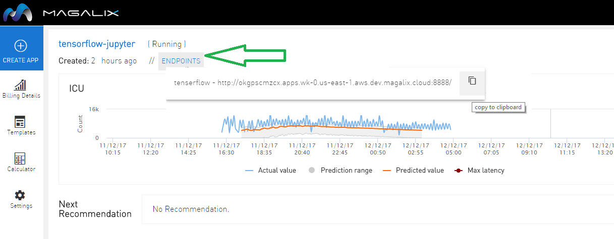

# Guestbook Example
**Guestbook Example** is an example shows how to build a simple multi-tier web application using Magalix. The application consists of a web front end, Redis master for storage, and replicated set of Redis slaves. 

## Installation
You can install Docuwiki on Magalix through few simple steps:

1- Create new app

2- Select Guestbook template from the Demo Apps templates

3- You can now get the running application URL from the console, by clicking Endpoints 

## View the guestbook
Open the application URL (from step 3 above) using your browser and enjoy.
