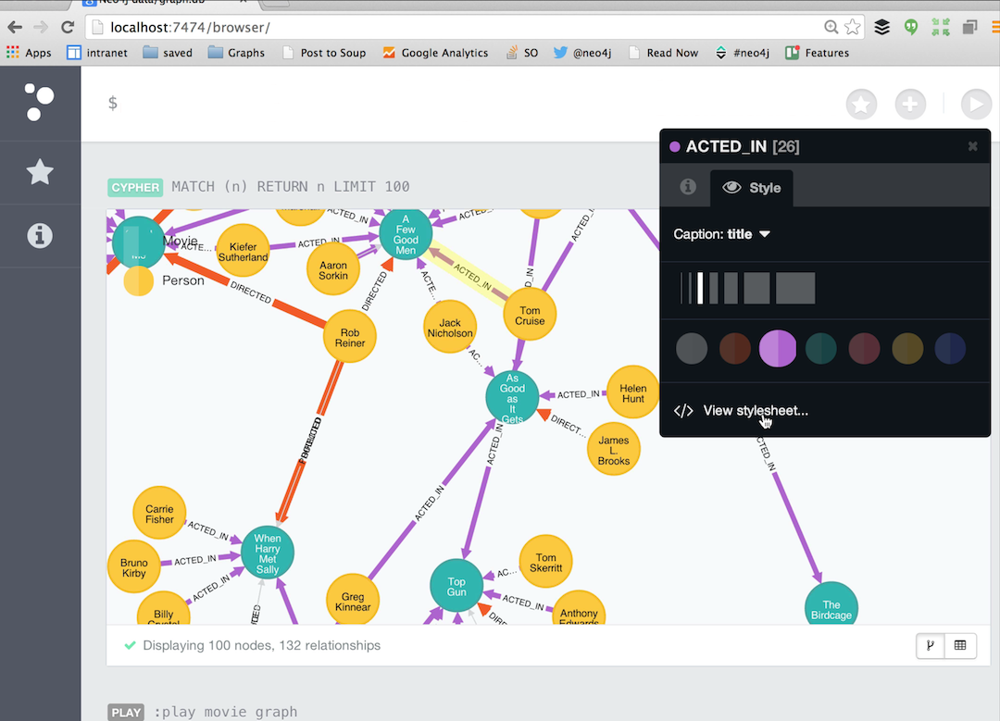

# Neo4j Browser
**Neo4j** is the world’s leading Graph Database. It is a high performance graph store with all the features expected of a mature and robust database, like a friendly query language and ACID transactions. The programmer works with a flexible network structure of nodes and relationships rather than static tables-yet enjoys all the benefits of enterprise-quality database. For many applications, Neo4j offers orders of magnitude performance benefits compared to relational DBs.

## Installation
You can install Neo4 on Magalix through few simple steps:

1- Create new app

2- Select Neo4j template from the Data Science templates

3- You can now get the running application URL from the console, by clicking Endpoints 

## View the Neo4j-browser
Open the application URL (from step 3 above) using your browser and enjoy.
