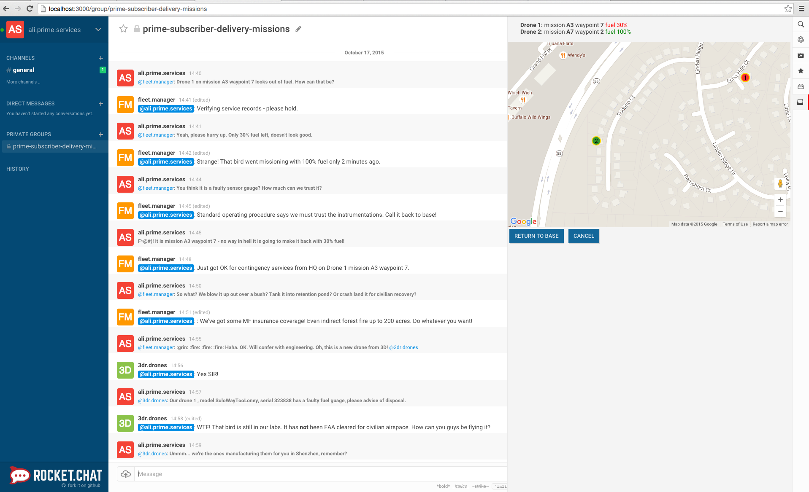

# Rocket.Chat
**Rocket.Chat** is a Web Chat Server, developed in JavaScript, using the Meteor fullstack framework. It is a great solution for communities and companies wanting to privately host their own chat service or for developers looking forward to build and evolve their own chat platforms.

## Installation
You can install Rocket.Chat on Magalix through few simple steps:

1- Create new app

2- Select Rocket.Chat template from the Demo Apps templates

3- You can now get the running application URL from the console, by clicking Endpoints 

## View the Neo4j-browser
Open the application URL (from step 3 above) using your browser and enjoy.
