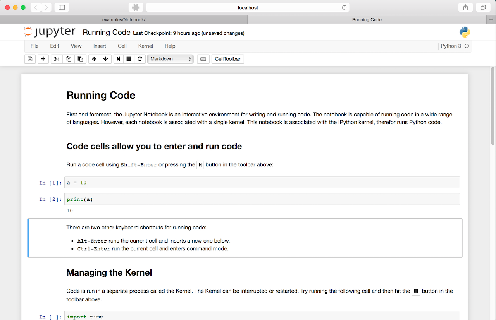
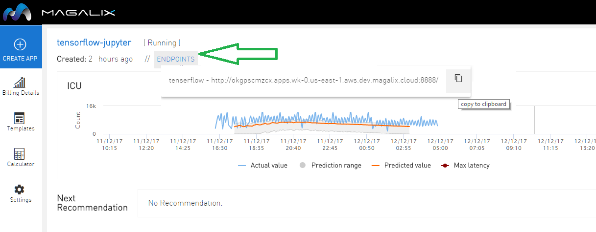
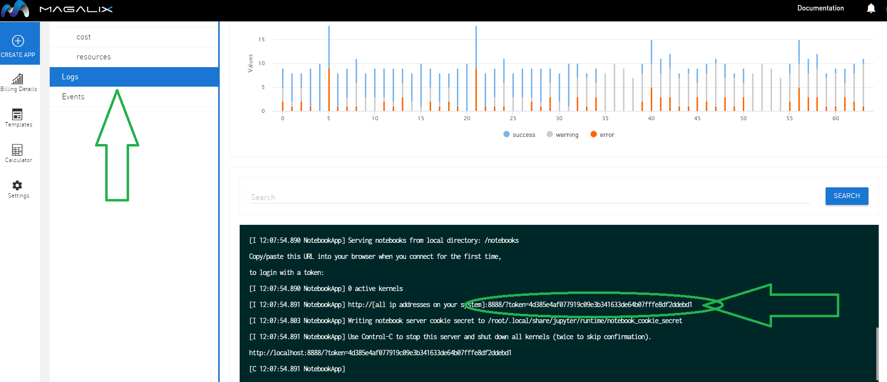

# Tensorflow-Jupyter Notebook
**TensorFlow** is an open source software library for numerical computation using data flow graphs. The graph nodes represent mathematical operations, while the graph edges represent the multidimensional data arrays (tensors) that flow between them.  It is a symbolic math library, and also used for machine learning applications such as neural networks. 

**Jupyter notebook** is a web-based notebook environment for interactive
computing.

### Jupyter notebook, the language-agnostic evolution of IPython notebook
Jupyter notebook is a language-agnostic HTML notebook application for
Project Jupyter. In 2015, Jupyter notebook was released as a part of
The Big Split™ of the IPython codebase. IPython 3 was the last major monolithic
release containing both language-agnostic code, such as the *IPython notebook*,
and language specific code, such as the *IPython kernel for Python*. 

## Installation

You can install tensorflow-jupyter-notebook on Magalix by few simple steps:

1- Create new app

2- Select tensorflow-jupyter template from the Data Science Apps templates

3- You can now get the running application URL from the console, by clicking Endpoints 

4- Since access to the Jupyter notebook server means access to running arbitrary code, it is important to restrict access to the notebook server. For this reason, notebook introduces token-based authentication that is on by default.
When token authentication is enabled, the notebook uses a token to authenticate requests.
This token can be provided to login to the notebook server in three ways:

- in the ``Authorization`` header, e.g.::

    Authorization: token abcdef...

- In a URL parameter, e.g.::

    http://app.magalix.cloud:8888/tree/?token=abcdef...

- In the password field of the login form that will be shown to you if you are not logged in.

When you start a notebook server with token authentication enabled (default),
a token is generated to use for authentication.
This token is logged to the terminal, so that you can copy/paste the URL into your browser::

    [I 11:59:16.597 NotebookApp] The Jupyter Notebook is running at:
    http://localhost:8888/?token=c8de56fa4deed24899803e93c227592aef6538f93025fe01

You can find the token in the log section at Magalix console

