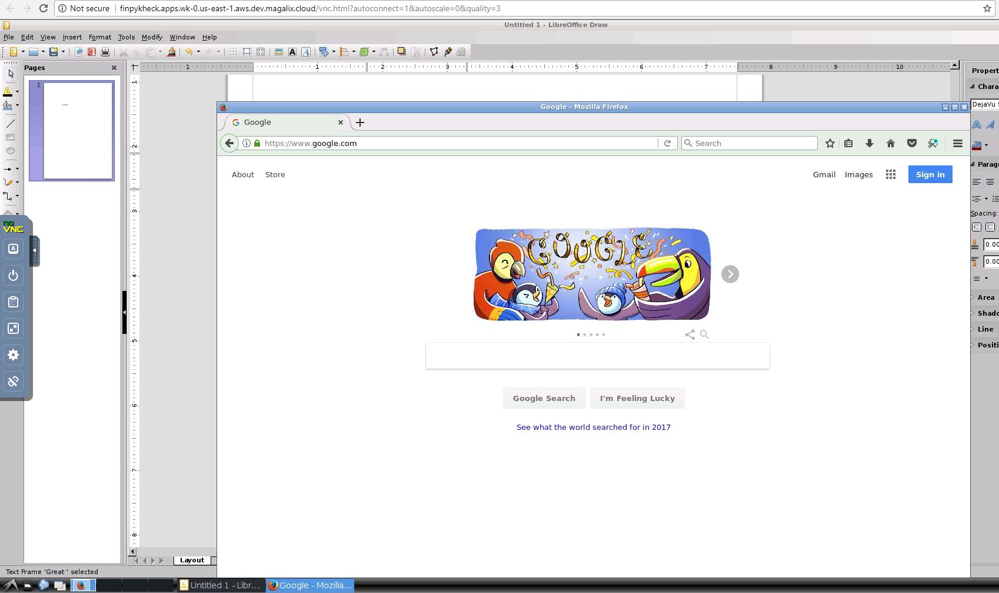

# Ubuntu-Desktop with HTML-VNC interface
This template contains an image for Ubuntu 16.04 LXDE desktop with HTML-VNC interace 

## Installation

You can install ubuntu-vnc on Magalix by few simple steps:

1- Create new app

2- Select ubuntu-vnc template from the Producticity Apps templates

3- You can now get the running application URL from the console, by clicking Endpoints 

4- Click the Endpoint URL to open the HTML-VNC client on a new tab. 

